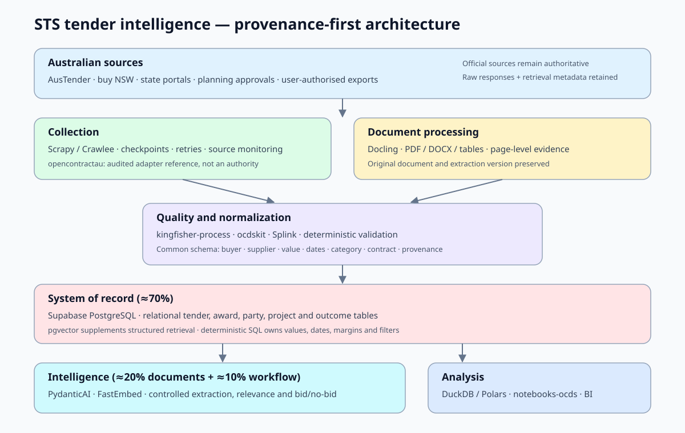
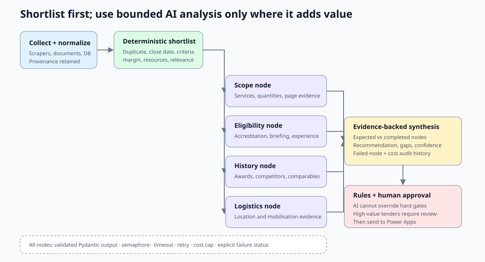

# STS Tender Intelligence

STS Tender Intelligence, also described in the product brief as GeoFlow
Opportunity Intelligence, is an Australia-focused geotechnical business
development platform prototype.

This first build is a working intelligence cockpit rather than a tender scraper.
It models how STS Geotechnics could monitor tenders, planning approvals,
developer activity, consultants, builders, competitors, and proposal readiness
in one daily operating view.

## Agentic Development Harness

All coding agents must begin with [`AGENTS.md`](AGENTS.md). Permanent product,
architecture, data, security, UX, design, acceptance, and definition-of-done
rules live under [`docs/`](docs/), with tender-specific behavioral contracts in
[`docs/specs/`](docs/specs/). Development follows a bounded
specification-to-evidence workflow rather than treating individual prompts as
the complete specification.

## Reference Architecture



The design keeps the relational procurement database as the system of record.
Document extraction and agent workflows enrich those records but do not own
basic filters, dates, values, margins or other deterministic calculations.

The community [`opencontractau`](https://github.com/demitonapp/opencontractau)
project is registered as a source-adapter reference, not a production data
dependency. Its licence, coverage, mappings, tests and operating behaviour must
pass the [adoption audit](docs/opencontractau-audit.md) at a pinned revision
before an adapter can be approved.

### Shortlisted-tender analysis



Parallel AI extraction is an optional processing layer for opportunities that
pass cheap deterministic filters. The Python
[`AnalysisGraph`](services/tender_analysis/orchestrator.py) uses validated
Pydantic models, bounded concurrency, retries, timeouts, cost limits, expected
node counts and explicit failure states. Hard bid gates remain deterministic and
high-value assessments require human review. See the
[runtime and integration guide](docs/parallel-analysis.md).

## Current Product Slice

- Pursue, Watch, and Archive queues with deterministic contextual scoring
- realistic Australian construction and infrastructure sample data
- predicted geotechnical scope, revenue range, timing, relationship context, and
  next best action for each opportunity
- source and stage filters for BD workflow triage
- AI agent status board covering tenders, planning approvals, developer
  tracking, document reading, proposal generation, and competitor monitoring
- proposal draft checklist and generated opening paragraph for the selected lead
- competitor market heat panel
- responsive dashboard layout for desktop and mobile
- authenticated estimator feedback designed for Cloudflare D1 persistence

## Local Development

```bash
npm install
npm run dev
npm run build
npm test
```

The app runs on the vinext/Next.js starter used by OpenAI Sites and is prepared
for a future Cloudflare Worker-compatible deployment.

## Cloudflare Deployment

The application deploys as a Cloudflare Worker with static assets through the
Cloudflare Vite plugin. Authenticate Wrangler once, then preview or deploy the
production build:

```bash
npx wrangler login
npm run preview
npm run deploy:check
npm run deploy
```

`deploy:check` builds and validates the complete Worker bundle without uploading
it. The deployment command explicitly targets the `sts-tender-intelligence`
Worker and preserves variables managed in the Cloudflare dashboard. For a
non-interactive deployment, provide a scoped `CLOUDFLARE_API_TOKEN` and
`CLOUDFLARE_ACCOUNT_ID` in the deployment environment rather than committing
credentials to this repository.

The production Worker is available at
<https://sts-tender-intelligence.poreddyjeevanreddy.workers.dev>, and its
[production deployment is managed in the Cloudflare dashboard](https://dash.cloudflare.com/0d2e259ca49dbaccaee1defdef4b7e16/workers/services/view/sts-tender-intelligence/production).

## Historical Award Dataset

The data pipeline builds a provenance-first master dataset from Commonwealth
AusTender awards and the NSW eTendering archive. Current buy NSW awards are
ingested from official Notice Report CSV exports because the legacy public API
was retired when the Register of notices replaced eTendering. The official
[NSW eTendering API repository](https://github.com/NSW-eTendering/NSW-eTendering-API)
is retained as a historical implementation and schema reference, not configured
as a live collection endpoint.

```bash
# Existing Commonwealth collector, resumable by publication day
npm run collect:austender -- --start=2016-08-19 --end=2026-08-19

# NSW Treasury archive preserved by the Open Contracting Data Registry
npm run collect:nsw:historical -- --start=2016-08-19 --end=2026-08-19

# Optional current buy NSW Notice Report exports
npm run import:nsw:reports -- --input="downloads/notices-2025.csv;downloads/notices-2026.csv"

# Optional community OCDS packages for ACT, QLD, NT, TAS, VIC and councils
npm run import:opencontractau -- --input="data/opencontractau-raw/act.json" --jurisdiction=ACT

# CSV, NDJSON, Parquet, RAG corpus, supplier summary, and quality report
npm run build:historical-dataset
npm run validate:historical-dataset

# Association lift, bundle economics, buyer concentration, and model gates
npm run build:strategic-insights

# 104-field wide dataset, relational CSVs, Parquet, SQL, and training extracts
npm run build:ml-dataset
```

Generated files are written under `data/historical-geotech/` and excluded from
Git. Every record retains its source portal, URL, source identifier, collection
timestamp, and extraction method. Geotechnical relevance is calculated across
title, scope, item descriptions, and category rather than title alone.

### OpenContractAU Adapter

[`opencontractau`](https://github.com/demitonapp/opencontractau) is integrated
as a pinned, optional source adapter and reference implementation. It runs
outside the Cloudflare Worker and produces OCDS release packages; this project
then validates and converts those packages into the same award contract used by
the official AusTender and NSW collectors.

```bash
# Install the exact source commit audited on 23 August 2026
python -m pip install -r requirements-opencontractau.txt

# Generate a package with the upstream CLI
opencontractau act --output data/opencontractau-raw/act.json

# Normalize it with STS provenance, classification and duplicate controls
npm run import:opencontractau -- --input=data/opencontractau-raw/act.json --jurisdiction=ACT
npm run build:historical-dataset
```

The audit is recorded in `config/external-source-adapters.json`. At the pinned
commit, all 239 upstream tests passed. It is not treated as production
infrastructure by itself: no PyPI distribution or GitHub release artifact was
available, and the nine scheduled refresh runs reviewed were failing during
workflow setup. The audit also records a declared/runtime version mismatch and
that incremental `since` filtering is unsupported for most jurisdiction
adapters. Its operational risk is therefore rated medium. Official feeds take
precedence whenever the same jurisdiction, contract, agency, and supplier
appear in both sources.

The ML export is written under `data/ml-tender-dataset/`. Its master table has
exactly 104 canonical fields, alongside normalized tender, award, supplier,
agency, project, feature, and bidder-outcome tables. Generic drilling only
qualifies as Tier A when ground context is present, and all exclusion evidence
is retained for audit rather than deleting the source record.

`ml_award_value_training.csv` contains rows with disclosed award values.
`ml_win_loss_training.csv` intentionally contains headers only until submitted
and unsuccessful bidder outcomes are available. Winner-only award records
cannot produce a defensible bidder win rate. The generated quality report also
blocks all-history incumbency features until they are calculated chronologically
to prevent future-data leakage.

## National Source Registry

`config/procurement-portals.json` records the official Commonwealth, state, and
territory portals plus VendorPanel. Only AusTender and the current buy NSW
Notice Report importer are marked as implemented. The retired official NSW
eTendering API repository is separately marked historical-reference-only so it
cannot be mistaken for a current collector. Other portals are explicitly
marked adapter-required, manual-export-only, or legal-review-required so
coverage is never overstated and authenticated access is never bypassed. Where
an audited OpenContractAU mapping exists, it is recorded as a gap-fill reference
without being mistaken for an operational SLA or authoritative official feed.

The first-build adapter contract covers buy NSW, VendorPanel, eProcure,
TenderLink, EstimateOne, AusTender and ICN. It standardises source records,
separates potential project leads from procurement opportunities, and links
multiple signals through `parent_project_id`. See
[`docs/source-adapters.md`](docs/source-adapters.md) for access boundaries,
canonical identity rules and the ingestion-before-AI processing order.

Cloudflare AI processing is implemented as an authenticated ingestion endpoint,
deterministic prefilter, optional Queue consumer, DeepSeek V4 Flash JSON
analysis, strict authoritative-field protection and D1 persistence. See
[`docs/deepseek-cloudflare.md`](docs/deepseek-cloudflare.md) for secrets, queue,
cron, migration and GitHub Actions setup.

## Estimator Feedback

The dashboard records Pursue, Watch, and Pass decisions through
`POST /api/feedback`. The Drizzle migration creates an
`opportunity_feedback` table with the tender, authenticated user, reason,
score, tier, timestamp, and model version. The Cloudflare deployment binds the
dedicated `sts-tender-intelligence-db` database as `DB`; its checked-in Drizzle
migration has been applied remotely. New environments must create their own D1
database, update `vite.config.ts`, and apply `drizzle/0000_known_junta.sql`
before enabling feedback. Without a D1 binding, the UI reports that storage is
unavailable instead of keeping a misleading local-only label.

## Strategic Procurement Analytics

`lib/strategic-insights.js` converts classified awards into auditable commercial
signals:

- deterministic scope entity extraction for drilling, CPT, laboratory testing,
  NATA, CPEng, monitoring, pavement, and environmental requirements
- UNSPSC and service-family co-occurrence with support, confidence, and lift
- standalone, multi-service, and turnkey package detection
- client/supplier repeat-award concentration, explicitly labelled as award
  share rather than bidder win rate
- exact SHAP contributions for calibrated linear-logit models with stored
  training-set background means
- evidence thresholds and model-readiness gates that stop unsupported causal or
  win-probability claims
- four-driver win/loss hypothesis generation with attributable-evidence gates
  and model-agnostic NLI verdicts that remain explicitly non-causal; see
  [`docs/specs/win-loss-validation.md`](docs/specs/win-loss-validation.md)
- structured NLI premises that label tender, regulatory, STS, winner, and
  constraint context; category fallbacks remain non-evidentiary, capability
  claims require dates, and repeated neutral output creates review work rather
  than autonomous collection or score changes
- authenticated DeepSeek V4 strategy synthesis for verified NSW tenders above
  AUD 500,000, gated on three `SUPPORTED` NLI findings above 90% and returned
  as a strictly validated, human-reviewed four-part memo; see
  [`docs/specs/strategy-synthesis.md`](docs/specs/strategy-synthesis.md)

The generated dashboard snapshot lives at
`app/data/strategic-insights.json`. Rebuild it after refreshing the historical
dataset.

## Public Contact Discovery

The contact-discovery layer creates narrow public-profile X-ray queries and can
collect Google result metadata through SerpApi. It does not request LinkedIn
profile pages, use authenticated sessions, or collect private contact data.

```bash
# Prints human-opened Google and DuckDuckGo search links when no key is set
npm run discover:contacts -- --company="Example Civil" --project="Western Sydney Airport"

# Uses SerpApi when configured; results remain excluded under data/
$env:SERPAPI_API_KEY="..."
npm run discover:contacts -- --company="Example Civil" --agency="Transport for NSW"
```

Automated scraping of DuckDuckGo's `/html` endpoint is intentionally not used
because its current `robots.txt` disallows that path. Google Custom Search JSON
is also not the default because it is closed to new customers and scheduled for
discontinuation for existing customers on 1 January 2027.

## Next Iterations

1. Operationalize and monitor the audited OpenContractAU mappings while adding
   independent official-source validation for QLD, VIC, TAS, ACT, and NT.
2. Add persistent opportunity, company, contact, and document tables alongside
   the estimator feedback table.
3. Add document ingestion for PDFs, Word files, drawings, scopes, BOQs, and
   planning reports.
4. Add authenticated CRM workflows for relationship owners, proposal drafts,
   call notes, reminders, and win/loss tracking.
5. Replace sample scoring weights with supervised scoring calibrated against STS
   historical jobs, margins, turnaround, and win rates.
